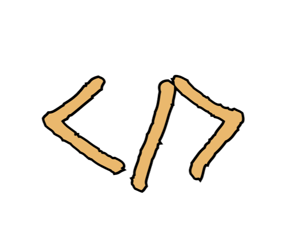

   
   <h2>
      <em>Portafolio</em> minimalista maquetado para web y pdf
   </h2>
   

      Esquema del JSON de CV de <a href="https://jsonresume.org/schema/">jsonresume.org</a>
   

   

      Basado en el diseño de <a href="https://github.com/midudev/minimalist-portfolio-json">midudev</a>
   

   
   
   
   
   

## 🛠️ Stack

- [**Svelte**](https://svelte.dev/) - El framework web de la nueva época.
- [**Typescript**](https://www.typescriptlang.org/) - JavaScript con sintaxis de tipado.

## 🔑 Licencia

[MIT](LICENSE) - Creado por [**charlsdev**](https://charlsdev.xyz).
