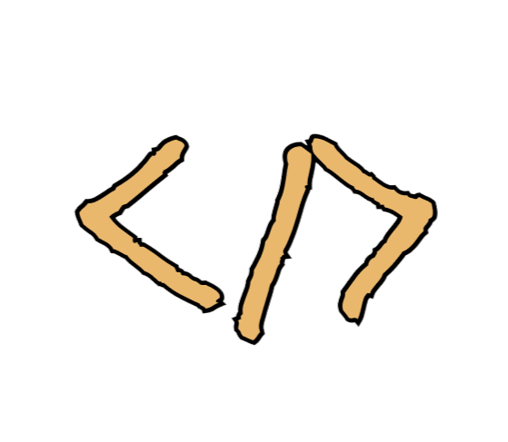

<div align="center">
   
   <h2><em>Portafolio</em> dinámico — SvelteKit + PostgreSQL</h2>
   <p>Esquema basado en <a href="https://jsonresume.org/schema/">JSON Resume</a> · diseño base de <a href="https://github.com/midudev/minimalist-portfolio-json">midudev</a></p>
</div>

Portafolio personal con SSR y panel de administración. El contenido del CV
vive en **PostgreSQL** y se edita desde `/admin` (sin redeploy).

## 🛠️ Stack

- **SvelteKit 2 + Svelte 5** — SSR vía `@sveltejs/adapter-node`.
- **PostgreSQL + Drizzle ORM** (`postgres.js`). Schema TS, sin migraciones (`db:push`).
- **TypeScript** en todo.

## 🗺️ Mapa del proyecto

| Ruta | Qué es |
|---|---|
| `src/routes/+page.svelte` · `+page.server.ts` | Sitio público. El `load` arma el CV desde la DB |
| `src/lib/components/*` `src/lib/icons/*` `src/lib/layout/*` | UI del portfolio (componentes originales) |
| `src/lib/cv-context.ts` | Inyecta el CV en contexto (SSR-safe); cada sección usa `getCv()` |
| `src/lib/server/cv-source.ts` | Único punto de lectura: DB → objeto `Root` (JSON Resume) |
| `src/lib/server/db/{schema,index}.ts` | Schema Drizzle relacional + cliente lazy |
| `src/lib/server/cv-repo.ts` | CRUD que usan las acciones del admin |
| `src/lib/server/auth.ts` · `src/hooks.server.ts` | Sesión por cookie firmada + guard de `/admin` |
| `src/routes/admin/*` | Panel: login, dashboard y CRUD por sección |
| `scripts/{db-create,seed}.ts` | Crear base `portfolio` y cargar el CV (`cv.json` real o `cv.example.json`) |

## 🚀 Desarrollo

```bash
pnpm install
cp .env.example .env            # completar credenciales

pnpm exec tsx scripts/db-create.ts   # crea la base 'portfolio'
pnpm db:push                          # crea las tablas
pnpm db:seed                          # carga inicial (src/cv.json si existe, si no cv.example.json)

pnpm dev                              # http://localhost:4000
```

Panel admin: `http://localhost:4000/admin` (credenciales `ADMIN_*` del `.env`).

## 📦 Scripts

| Script | Acción |
|---|---|
| `pnpm dev` | Dev server (Vite, puerto 4000) |
| `pnpm build` / `pnpm start` | Build adapter-node / servirlo |
| `pnpm check` | `svelte-kit sync` + `svelte-check` |
| `pnpm db:push` | Sincroniza schema TS → Postgres |
| `pnpm db:seed` | Carga/reset desde `src/cv.json` (o `cv.example.json` si no existe) |
| `pnpm db:studio` | Drizzle Studio |

## 🌐 Despliegue

Dokploy con Dockerfile. Detalle y variables de entorno en **[DEPLOY.md](DEPLOY.md)**
(ojo con `ORIGIN`, es obligatorio para que el panel admin funcione tras el proxy).

## 🔑 Licencia

[MIT](LICENSE) — [**charlsdev**](https://charlsdev.xyz).
